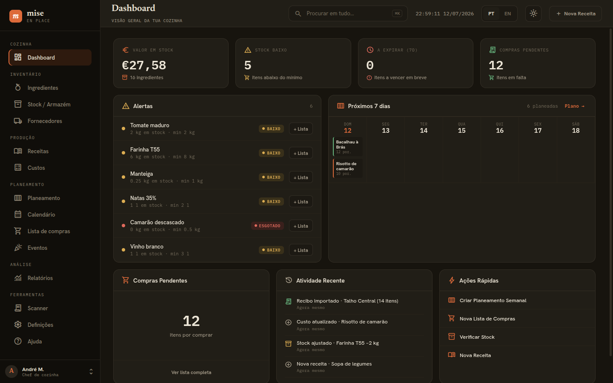

# mise — Recipe Planner

> **mise** [/miːz/] — *culinary term: "everything in its place"*

A professional-grade recipe management and kitchen planning application built with **Tauri 2**, **Rust**, **React 19**, and **libSQL**. Designed for real kitchen workflows — from ingredient tracking and cost analysis to weekly meal planning and shopping list generation.

<p align="center">
  
</p>

---

## ✨ Features

### 🥬 Ingredients Management
- **Full CRUD** — Create, read, update, delete ingredients
- **33 unit types** — Weight (g, kg, oz, lb...), Volume (ml, l, cup, tsp...), Count (pcs, dozen, pinch...)
- **Categories & favorites** — Organize with custom categories, mark frequent items
- **Price tracking** — Price per unit with supplier quotes history
- **Stock integration** — Real-time quantity, min thresholds, status (OK / Low / Out)

### 🍳 Recipes
- **Full CRUD** with ingredients, portions, instructions, prep/cook times
- **Cost breakdown** — Automatic per-portion cost calculation from ingredient prices
- **Margin analysis** — Target margin % → suggested sale price
- **Tags, categories, favorites, images** — Rich metadata for organization
- **Clone & scale** — Duplicate recipes, auto-scale ingredient quantities

### 📦 Stock / Armazém
- **Live inventory** — Quantity on hand, minimum thresholds
- **Status badges** — 🟢 OK · 🟡 Low · 🔴 Out
- **Quick adjust** — Inline quantity updates
- **Low-stock alerts** — Dashboard widget + Reports

### 🛒 Shopping Lists
- **Create from recipes** — Select recipes × portions → auto-generated consolidated list
- **Create from meal plans** — Weekly plan → shopping list in one click
- **Categories** — Auto-grouped by ingredient category (Hortícolas, Carnes, Laticínios...)
- **Purchased toggle** — Mark items bought, timestamped
- **Inline edit** — Quantity, notes, cost adjustments
- **Reorder & clear purchased** — Drag-to-reorder, bulk clear

### 📅 Meal Planner
- **Weekly grid** — Mon–Sun × Breakfast/Lunch/Dinner/Snack
- **Drag & drop** — Assign recipes to slots
- **Portion multiplier** — Scale per entry (e.g., family dinner ×4)
- **Shopping list generation** — One-click from active week

### 🗓️ Calendar
- **Month & week views** — Navigate any date range
- **Meal display** — See planned recipes per day/meal type
- **Quick add** — Click empty slot → select recipe

### 📊 Dashboard
- **Stats cards** — Total ingredients, recipes, meal plans, shopping lists
- **Low stock widget** — Top 5 items needing restock
- **Upcoming meals** — Next 7 days from meal planner
- **Recent activity** — Last 10 actions (create/update/delete)

### ⚙️ Settings
- **Units** — Default weight/volume/count units
- **Currency** — Symbol, position, decimals (€, $, £, BRL...)
- **Theme** — Dark (default) / Light / System
- **Data** — Export (JSON), Import (with conflict resolution), Reset to defaults
- **Sync placeholder** — Cloud/local sync structure ready

### 🚚 Suppliers & Price Quotes
- **Supplier CRUD** — Name, contact, notes
- **Price quotes per ingredient** — Supplier, price/unit, validity dates, promo flag
- **Price history** — Track cost changes over time
- **Statistics** — Best price, average, quote count per ingredient

### 📈 Reports
- **Cost Report** — Total spend, per-period breakdown, top cost ingredients
- **Waste Report** — Expired/discarded items, estimated loss value
- **Stock Trends** — Quantity over time per ingredient (chart-ready data)
- **Meal Stats** — Meals planned, portions cooked, category distribution
- **Price Trends** — Ingredient price history with moving averages

---

## 🏗 Architecture

```
mise/
├── crates/
│   ├── core/           # mise-core — Domain models, DB, migrations, queries
│   │   ├── src/
│   │   │   ├── domain.rs   # 50+ types: Ingredient, Recipe, Stock, ShoppingList...
│   │   │   ├── db.rs       # libSQL connection, 10 migrations, 80+ query fns
│   │   │   ├── converter.rs# Unit conversion helpers
│   │   │   └── lib.rs
│   │   └── Cargo.toml
│   └── tauri/          # mise-tauri — Tauri command handlers (thin wrapper)
│       ├── src/
│       │   ├── lib.rs      # AppDb + 100+ command handlers
│       │   └── commands.rs # #[tauri::command] exports
│       └── Cargo.toml
├── src-tauri/          # Tauri 2 app entry (mise binary)
│   ├── src/main.rs     # mise_lib::run()
│   ├── Cargo.toml
│   └── tauri.conf.json
├── src/                # React 19 + TypeScript frontend
│   ├── pages/          # 11 page components (Dashboard, Ingredients, Recipes...)
│   ├── components/     # Layout, Sidebar, IngredientAvatar, PlaceholderPage
│   ├── styles/
│   │   └── theme.css   # CSS variables design system (1200+ lines)
│   ├── i18n/           # PT/EN translations
│   ├── router.tsx      # React Router v7 routes
│   └── main.tsx
├── package.json        # npm scripts, deps (React 19, Vite 6, Tauri API)
├── Cargo.toml          # Workspace root (mise-core, mise-tauri, src-tauri)
├── tsconfig.json
├── vite.config.ts
└── README.md           # ← You are here
```

### Key Design Decisions

| Aspect | Choice | Rationale |
|--------|--------|-----------|
| **Database** | libSQL (SQLite + WASM) | Local-first, offline-capable, mobile-ready, zero-config |
| **Architecture** | 2-crate workspace | Clean separation: core logic reusable outside Tauri (tests, CLI, mobile) |
| **Async** | tokio + libSQL pool | Native async, connection pooling, WAL mode for concurrency |
| **Type Safety** | specta + ts-rs | Rust → TypeScript types auto-generated, zero drift |
| **Validation** | validator crate | Input validation at domain boundary |
| **Styling** | CSS Variables (no framework) | Zero runtime, themeable, mobile-first, 3-tier depth system |
| **Routing** | React Router v7 | File-free, type-safe, SSR-ready |

---

## 📋 Prerequisites

| Tool | Version | Notes |
|------|---------|-------|
| **Rust** | ≥ 1.75 | `rustup default stable` |
| **Node.js** | ≥ 20 | LTS recommended |
| **pnpm** | ≥ 9 | Or npm/yarn |
| **libSQL** | bundled | No system install needed (vendored in crate) |

### Linux System Dependencies (for Tauri desktop)

```bash
# Debian/Ubuntu
sudo apt update && sudo apt install -y \
  libwebkit2gtk-4.1-dev \
  libayatana-appindicator3-dev \
  librsvg2-dev \
  libssl-dev \
  pkg-config \
  libdbus-1-dev \
  libgtk-3-dev \
  libsoup-3.0-dev

# Arch/Manjaro
sudo pacman -S webkit2gtk-4.1 libayatana-appindicator librsvg openssl pkgconf dbus gtk3 libsoup3

# Fedora
sudo dnf install webkit2gtk4.1-devel libayatana-appindicator-gtk3-devel librsvg2-devel openssl-devel pkgconf dbus-devel gtk3-devel libsoup3-devel
```

### Android (optional)

```bash
# Install Android SDK, NDK, and targets via Android Studio
# Then:
rustup target add aarch64-linux-android armv7-linux-androideabi i686-linux-android x86_64-linux-android
```

---

## 🚀 Development

### Desktop (Tauri)

```bash
# Install deps
pnpm install          # or npm install

# Run in dev mode (hot reload frontend + cargo watch backend)
cargo run             # from project root

# Or separately:
# Terminal 1: pnpm run dev      # Vite dev server at http://localhost:1420
# Terminal 2: cargo tauri dev   # Tauri window pointing to dev server
```

### Web (Browser)

```bash
pnpm run dev          # Vite dev server
# Open http://localhost:5173 (or printed port)
```

### Android

```bash
# Requires Android SDK/NDK configured
cargo tauri android init   # First time only
cargo tauri android dev    # Dev on device/emulator
cargo tauri android build  # Release APK/AAB
```

### Useful Commands

```bash
# Type-check frontend
pnpm run build        # tsc + vite build (no emit)

# Check Rust types
cargo check --workspace

# Auto-format
cargo fmt --all
pnpm run format       # if prettier configured

# Lint
cargo clippy --workspace -- -D warnings
```

---

## 🏗 Build & Release

### Desktop (Linux/macOS/Windows)

```bash
# Release build (optimized)
cargo tauri build

# Artifacts in:
# src-tauri/target/release/bundle/
#   ├── deb/     # .deb (Debian/Ubuntu)
#   ├── appimage/ # .AppImage (universal Linux)
#   ├── msi/     # .msi (Windows)
#   └── dmg/     # .dmg (macOS)
```

### Web (Static Export)

```bash
pnpm run build        # Outputs to dist/
# Deploy dist/ to any static host (Netlify, Vercel, GitHub Pages, Nginx...)
```

### Android

```bash
cargo tauri android build
# Output: src-tauri/gen/android/app/build/outputs/bundle/release/app-release.aab
#         src-tauri/gen/android/app/build/outputs/apk/release/app-release.apk
```

---

## ⚙️ Configuration

### App Settings (Runtime)

Settings are stored in the `settings` table (key-value, JSON values). Key categories:

| Category | Keys | Example |
|----------|------|---------|
| **General** | `language`, `first_run` | `"pt"`, `"true"` |
| **Units** | `default_weight_unit`, `default_volume_unit`, `default_count_unit` | `"gram"`, `"milliliter"`, `"piece"` |
| **Currency** | `currency_symbol`, `currency_position`, `currency_decimals` | `"€"`, `"after"`, `"2"` |
| **Theme** | `theme_mode` | `"dark" \| "light" \| "system"` |
| **Data** | `auto_backup`, `backup_interval_days` | `"true"`, `"7"` |
| **Sync** | `sync_enabled`, `sync_endpoint` | `"false"`, `""` |

### Theme Customization (CSS Variables)

Edit `src/styles/theme.css` — all design tokens are CSS custom properties:

```css
:root {
  /* Brand (amber/gold — heat, caramelization, Michelin) */
  --brand:        #d4a843;
  --brand-dim:    #b89139;
  --brand-muted:  #3d351a;

  /* Semantic — kitchen traffic lights */
  --ok:           #22c55e;   /* Stock OK */
  --warn:         #f59e0b;   /* Low stock */
  --danger:       #ef4444;   /* Out of stock */

  /* Layout */
  --sidebar-w:    280px;
  --header-h:     64px;
  --radius:       8px;
}
```

Dark mode is default; light mode auto-applies via `@media (prefers-color-scheme: light)`.

---

## 🧪 Testing

```bash
# Rust unit/integration tests
cargo test --workspace

# Frontend tests (Vitest)
pnpm run test         # if configured

# E2E (Playwright)
pnpm run test:e2e     # if configured
```

### Test Structure

```
crates/core/tests/    # Domain logic, migrations, converters
crates/tauri/tests/   # Command handler integration tests
src/__tests__/        # React component tests
e2e/                  # Playwright specs
```

---

## 📁 Project Structure Detail

```
mise/
├── .github/workflows/  # CI/CD (build, test, release)
├── crates/
│   ├── core/
│   │   ├── src/
│   │   │   ├── db.rs           # 2800+ lines: open_db, migrations, 80+ query fns
│   │   │   ├── domain.rs       # 900+ lines: 50+ types, enums, validation
│   │   │   ├── converter.rs    # Unit conversion (g↔kg, ml↔l, etc.)
│   │   │   └── lib.rs
│   │   └── Cargo.toml
│   └── tauri/
│       ├── src/
│       │   ├── lib.rs          # AppDb: 100+ methods wrapping mise-core
│       │   └── commands.rs     # #[tauri::command] exports
│       └── Cargo.toml
├── src-tauri/
│   ├── src/main.rs             # 4 lines: mise_lib::run()
│   ├── Cargo.toml              # deps: mise-core, mise-tauri, tauri plugins
│   ├── tauri.conf.json         # Tauri 2 config
│   └── icons/                  # App icons (generated)
├── src/
│   ├── pages/                  # 11 pages (Dashboard, Ingredients, Recipes,
│   │   │                        #  Costs, Stock, ShoppingList, MealPlanner,
│   │   │                        #  Calendar, Settings, Suppliers, Reports)
│   ├── components/
│   │   ├── Layout.tsx          # App shell: sidebar + header + content
│   │   ├── Sidebar.tsx         # Navigation (14 items)
│   │   ├── IngredientAvatar.tsx# Colored icon + initial
│   │   └── PlaceholderPage.tsx # For unimplemented routes
│   ├── styles/theme.css        # 1200+ lines: design system
│   ├── i18n/                   # pt.ts, en.ts, types.ts, index.tsx
│   ├── router.tsx              # React Router v7 routes
│   ├── main.tsx                # Entry: providers + router
│   └── App.tsx
├── dist/                       # Built web assets (gitignored)
├── package.json
├── tsconfig.json
├── vite.config.ts
├── Cargo.toml                  # Workspace root
├── Cargo.lock
└── README.md
```

---

## 🔧 Tech Stack Summary

| Layer | Technology | Version |
|-------|------------|---------|
| **App Framework** | Tauri | 2.x |
| **Backend Language** | Rust | 2021 edition |
| **Frontend Framework** | React | 19.x |
| **Language** | TypeScript | 5.7+ |
| **Build Tool** | Vite | 6.x |
| **Database** | libSQL (SQLite) | 0.6 |
| **Async Runtime** | Tokio | 1.x |
| **Serialization** | Serde + Specta + ts-rs | Latest |
| **Validation** | Validator | 0.18 |
| **Date/Time** | Chrono | 0.4 |
| **Routing** | React Router | 7.x |
| **Styling** | CSS Variables (Custom Properties) | Native |
| **Icons** | Inline SVG + Unicode | — |
| **Mobile** | Tauri Mobile (Android) | 2.x |

---

## 📄 License

**MIT License** — see [LICENSE](LICENSE) for details.

> *mise* is free, open-source software. Use it, modify it, share it — just keep the license notice.

---

## 🤝 Contributing

Contributions are welcome! Please read our contributing guide before submitting PRs.

### Quick Checklist

- [ ] **Conventional Commits** — `feat:`, `fix:`, `docs:`, `refactor:`, `test:`, `chore:`
- [ ] **Rust fmt + clippy** — `cargo fmt && cargo clippy --workspace -D warnings`
- [ ] **TypeScript strict** — `pnpm run build` passes (tsc no errors)
- [ ] **Tests pass** — `cargo test --workspace`
- [ ] **Update docs** — README, CHANGELOG, inline comments if behavior changes

### Development Workflow

1. Fork & clone
2. Create feature branch: `git checkout -b feat/amazing-feature`
3. Make changes with tests
4. Run full check: `cargo fmt && cargo clippy --workspace -D warnings && cargo test --workspace && pnpm run build`
5. Commit with conventional message
6. Push & open PR

### Areas Seeking Help

- 📱 **iOS support** — Tauri mobile iOS target
- 🌐 **Full i18n** — Currently PT/EN, need ES, FR, DE...
- 📊 **Charts/Visualizations** — Reports page needs Recharts/Chart.js integration
- 🔄 **Sync/Backup** — Cloud sync implementation (Supabase, Firebase, custom)
- ♿ **Accessibility** — ARIA, keyboard nav, screen reader testing
- 🧪 **Test coverage** — Unit, integration, E2E

---

## 🙏 Acknowledgments

- **Tauri Team** — For the incredible Tauri 2 framework
- **libSQL/Turso** — For the embeddable, sync-capable SQLite
- **Specta & ts-rs** — For seamless Rust↔TypeScript type sharing
- **Inter & JetBrains Mono** — Beautiful, readable fonts
- **Culinary professionals** — Who inspired the workflow-first design

---

## 📞 Support

- **Issues** — [GitHub Issues](https://github.com/your-org/mise/issues)
- **Discussions** — [GitHub Discussions](https://github.com/your-org/mise/discussions)
- **Security** — Email security@mise.app (PGP key in repo)

---

<p align="center">
  <strong>Built with ❤️ for cooks, chefs, and kitchen operators everywhere.</strong><br>
  <em>mise en place — everything in its place.</em>
</p>