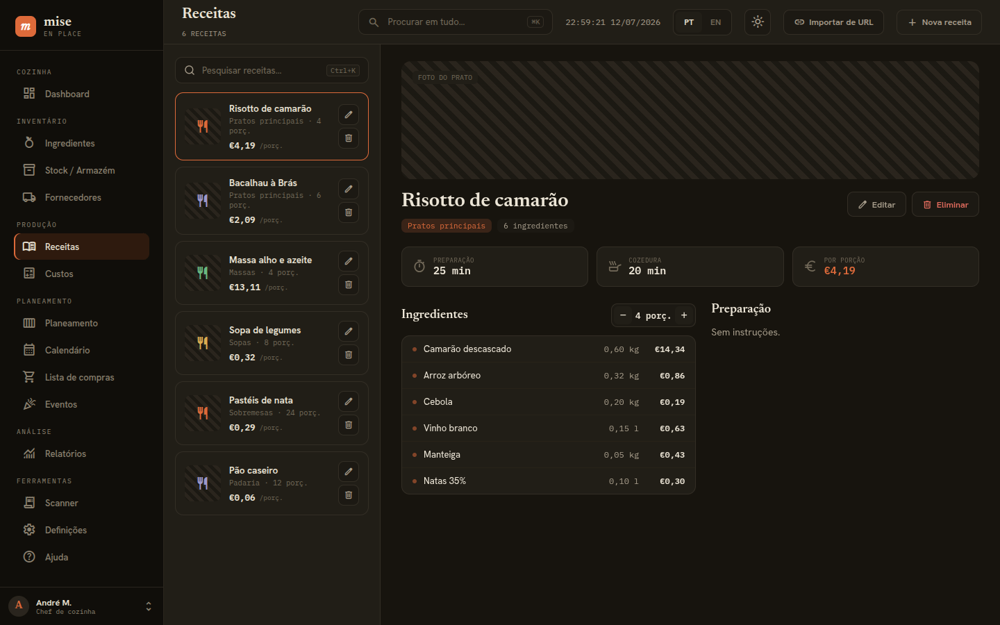

# mise — Recipe Planner

> **mise** [/miːz/] — *culinary term: "everything in its place"*

A kitchen management app for planning menus, tracking stock and costing recipes — built with **Tauri 2**, **Rust**, **React 19** and **libSQL**, running as a local-first desktop app (Linux/macOS/Windows) with an Android build.

<p align="center">
  
</p>

## Features

### Ingredients & Stock
- Ingredient catalog with 20 units (weight, volume, count), categories and favorites
- Stock levels with min-quantity thresholds and OK / Low / Out status
- Suppliers with per-ingredient price quotes and quote history

### Recipes & Costs
- Recipe CRUD with ingredients, portions, prep/cook time, tags, photo
- Automatic cost-per-portion, computed live from ingredient prices and unit conversion
- Margin analysis (Custos page): target margin % → suggested sale price
- Import a recipe from a URL

### Planning
- Weekly meal planner (drag recipes onto Mon–Sun × Breakfast/Lunch/Dinner/Snack)
- Calendar view of planned meals
- Shopping lists — create manually, add/edit items, group by category, mark purchased
- Events — isolated ingredient/recipe workspaces for one-off catering jobs, with items promotable back into the main catalog

### Receipt Scanner
- Photograph or upload a paper receipt; OCR (Tesseract.js, runs fully offline in the browser) extracts line items, quantities and prices
- Reads the Portuguese "Resumo IVA" tax table to tag each line food/non-food automatically
- Confirmed lines are recorded as stock purchases in one step

### Reports
- Cost report (spend over time, top-cost ingredients), meal stats, price trends — all live from real data
- Waste report and stock-over-time trends are **not implemented yet** — no waste log or stock-history table exists, so those tabs are intentionally empty rather than showing invented numbers

### Dashboard
- Stock value, low-stock count, expiring count, pending purchases — each card links to its section
- Upcoming 7 days, recent activity feed, quick actions

## Screenshots

<p align="center">
  
  
</p>

## Install

Grab a built binary from [Releases](https://github.com/Santolass06/Recipe_Planner/releases) — `.AppImage` or `.deb` for Linux. No installer for macOS/Windows yet; build from source (below).

## Development

### Prerequisites

| Tool | Version |
|------|---------|
| Rust | ≥ 1.75 (`rustup default stable`) |
| Node.js | ≥ 20 |
| npm | bundled with Node |

Linux also needs the Tauri/WebKitGTK system packages:

```bash
# Debian/Ubuntu
sudo apt install -y libwebkit2gtk-4.1-dev libayatana-appindicator3-dev \
  librsvg2-dev libssl-dev pkg-config libdbus-1-dev libgtk-3-dev libsoup-3.0-dev
```

### Run

```bash
npm install
cargo tauri dev        # desktop app, hot reload
# or: npm run dev       # frontend only in a browser, seeded/mock data (no Tauri backend)
```

### Build

```bash
cargo tauri build       # bundles in src-tauri/target/release/bundle/{deb,appimage,msi,dmg}
```

### Android

```bash
rustup target add aarch64-linux-android armv7-linux-androideabi i686-linux-android x86_64-linux-android
cargo tauri android init   # first time only
cargo tauri android build
```

### Checks

```bash
cargo check --workspace && cargo test --workspace
npm run build            # tsc typecheck + vite build
```

## Architecture

```
crates/core/    # mise-core   — domain types, libSQL migrations, ~106 query functions (db.rs)
crates/tauri/   # mise-tauri  — thin AppDb wrapper exposing 105 #[tauri::command]s
src-tauri/      # Tauri 2 app entry, bundler config
src/            # React 19 + TypeScript frontend (15 pages), i18n (PT/EN), CSS-variables design system
```

Rust → TypeScript types are generated with `specta`/`ts-rs` into `crates/core/bindings/`, so frontend and backend types can't drift.

## License

MIT — see [LICENSE](LICENSE).
