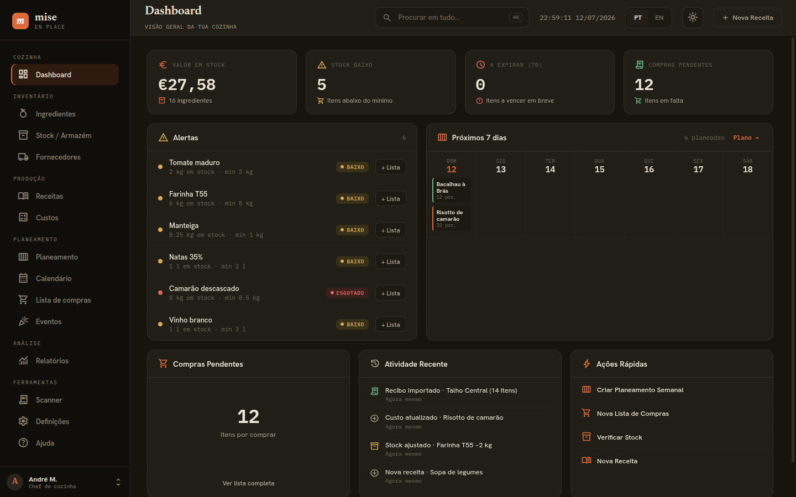
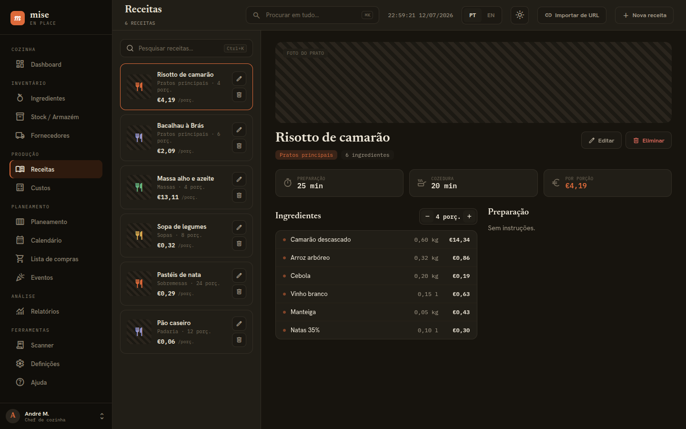

# mise — Recipe Planner

> **mise** [/miːz/] — *culinary term: "everything in its place"*

A kitchen management app for planning menus, tracking stock and costing recipes — built with **Tauri 2**, **Rust**, **React 19** and **libSQL**, running as a local-first desktop app.

**Platform status, stated plainly:** Linux is the only target built and shipped today. Windows and Android are planned and not started; macOS and iOS are out of scope. See [`PROJECT.md`](PROJECT.md) for the roadmap.

<p align="center">
  
</p>

## Features

### Ingredients & Stock
- Ingredient catalog with 20 units (weight, volume, count), categories and favorites
- Stock levels with min-quantity thresholds and OK / Low / Out status
- Suppliers with per-ingredient price quotes and quote history

### Recipes & Costs
- Recipe CRUD with ingredients, portions, prep/cook time, tags, photo
- Automatic cost-per-portion, computed live from ingredient prices and unit conversion
- Margin analysis (Custos page): target margin % → suggested sale price
- Import a recipe from a URL

### Planning
- Weekly meal planner (drag recipes onto Mon–Sun × Breakfast/Lunch/Dinner/Snack)
- Calendar view of planned meals
- Shopping lists — create manually, add/edit items, group by category, mark purchased
- Events — isolated ingredient/recipe workspaces for one-off catering jobs, with items promotable back into the main catalog

### Receipt Scanner
- Photograph or upload a paper receipt; OCR (Tesseract.js, runs fully offline in the browser) extracts line items, quantities and prices
- Reads the Portuguese "Resumo IVA" tax table to tag each line food/non-food automatically
- Confirmed lines are recorded as stock purchases in one step

### Reports
- Cost report (spend over time, top-cost ingredients), meal stats, price trends — all live from real data, sourced from actual purchases rather than shopping-list estimates
- Waste report and stock-over-time trends are **not implemented yet** — the app models acquisition but not yet consumption, so there is no waste log or stock history to report on. Those tabs say what is missing rather than showing invented numbers. Closing this is the next structural piece of work (sprints S2–S4 in [`PROJECT.md`](PROJECT.md))

### Backup

- Full backup to a single JSON file — 18 tables plus stored images, ids preserved
- Restore replaces everything and asks for confirmation first
- Separate from "export data", which is a readable subset for sharing, not a backup

### Dashboard
- Stock value, low-stock count, expiring count, pending purchases — each card links to its section
- Upcoming 7 days, recent activity feed, quick actions

## Screenshots

<p align="center">
  
  
</p>

## Install

Grab a built binary from [Releases](https://github.com/Santolass06/Recipe_Planner/releases) — `.AppImage` or `.deb` for Linux. Other platforms are not built yet; build from source (below).

## Development

### Prerequisites

| Tool | Version |
|------|---------|
| Rust | ≥ 1.75 (`rustup default stable`) |
| Node.js | ≥ 20 |
| npm | bundled with Node |

Linux also needs the Tauri/WebKitGTK system packages:

```bash
# Debian/Ubuntu
sudo apt install -y libwebkit2gtk-4.1-dev libayatana-appindicator3-dev \
  librsvg2-dev libssl-dev pkg-config libdbus-1-dev libgtk-3-dev libsoup-3.0-dev
```

On NixOS, `shell.nix` provides all of the above — every `cargo` command below
has to run inside it, or `openssl-sys` fails to find `openssl.pc`:

```bash
nix-shell --run "cargo test --workspace"
```

### Run

```bash
npm install
cargo tauri dev        # desktop app, hot reload
# or: npm run dev       # frontend only in a browser, seeded/mock data (no Tauri backend)
```

### Build

```bash
cargo tauri build       # bundles in src-tauri/target/release/bundle/{deb,appimage}
```

### Android

Not wired up yet — the signing config and workflow were removed and are due
back in sprint S7. The commands below are the starting point, not a working
build:

```bash
rustup target add aarch64-linux-android armv7-linux-androideabi i686-linux-android x86_64-linux-android
cargo tauri android init   # first time only
cargo tauri android build
```

### Checks

```bash
cargo check --workspace && cargo test --workspace
npx tsc --noEmit         # typecheck alone; also runs in CI
npm run build            # tsc typecheck + vite build
```

## Architecture

```
crates/core/    # mise-core   — domain types, libSQL migrations, query functions (db.rs)
crates/tauri/   # mise-tauri  — thin AppDb wrapper exposing the #[tauri::command] surface
src-tauri/      # Tauri 2 app entry, bundler config
src/            # React 19 + TypeScript frontend, i18n (PT/EN), CSS-variables design system
```

`crates/core` has no Tauri dependency. That is deliberate: a server front-end
is a second consumer of the same crate rather than a rewrite.

Rust → TypeScript types are generated with `ts-rs` into `crates/core/bindings/`,
so frontend and backend types can't drift.

Counts change every week, so they are not written down here. To get them:

```bash
grep -c '#\[tauri::command\]' crates/tauri/src/lib.rs   # commands
cargo test --workspace 2>&1 | grep '^test ' | grep -vc export_bindings   # real tests
```

## Project docs

| File | What it is |
|------|-----------|
| [`PROJECT.md`](PROJECT.md) | The plan — what is left, in sprints |
| [`CHANGELOG.md`](CHANGELOG.md) | What was done, and what was hard about it |
| [`docs/AUDIT-2026-07.md`](docs/AUDIT-2026-07.md) | Full internal audit, 2026-07-26 |
| `legacy/` | Superseded documents, kept for reference |

## License

MIT — see [LICENSE](LICENSE).
