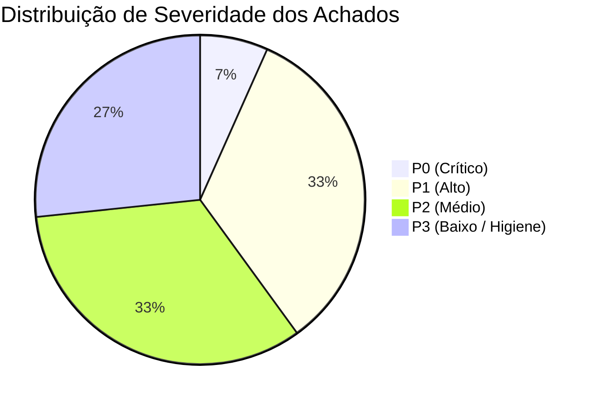
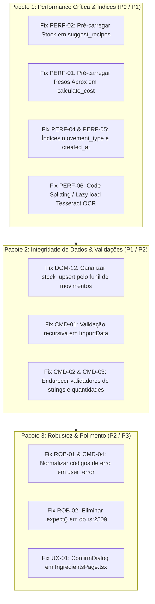

# Relatório de Auditoria Integral — mise (Fase 2 Concluída)

**Data:** 2026-08-21  
**Branch:** `google-audit`  
**Metodologia:** Análise estática, leitura comando-a-comando, verificação cruzada com equipa de 4 subagentes especializados e formulação de testes-prova executáveis.

---

## 1. Sumário Executivo de Achados (Matriz de Severidade)



| ID | Severidade | Área | Ficheiro:Linha | Descrição Sumária | Impacto |
|---|---|---|---|---|---|
| **PERF-02** | **P0** | Performance | `crates/core/src/db.rs:2116` | **N+1 Crítico em `suggest_recipes`**: Varre todas as receitas e executa queries SQL individuais de stock por ingrediente em loop. | Degradação severa de tempo de resposta em bases de dados com muitas receitas. |
| **DOM-12** | **P1** | Domínio / Stock | `crates/core/src/db.rs:1595`<br>`crates/tauri/src/lib.rs:152` | **Furo no Funil (`upsert_stock`)**: O comando `stock_upsert` altera diretamente `stock.quantity` sem criar movimento no funil `stock_movements`. | Ao correr `stock_reconcile`, o valor ajustado é revertido silenciosamente para a soma histórica dos movimentos. |
| **CMD-01** | **P1** | IPC / Validação | `crates/core/src/domain.rs:860`<br>`crates/tauri/src/lib.rs:438` | **Falta de Validação em `ImportData`**: Dados importados entram sem validação de structs aninhadas antes da inserção na BD em `import_data`. | Risco de corrupção da base de dados ao importar ficheiros malformados ou com valores negativos. |
| **PERF-01** | **P1** | Performance | `crates/core/src/db.rs:3015` | **N+1 em `calculate_cost`**: Consultas repetidas a `approximate_unit_weights` por linha de ingrediente dentro do loop de custo. | Cálculos lentos em receitas complexas ou relatórios de custo massivos. |
| **PERF-04** | **P1** | Base de Dados | `crates/core/src/db.rs:528` | **Ausência de Índice `movement_type`**: `get_waste_report` faz table scan em `stock_movements` com filtro `WHERE movement_type = 'loss'`. | Consultas ao relatório de desperdício ficam lentas com o crescimento do histórico de movimentos. |
| **PERF-06** | **P1** | Frontend / Bundle | `src/router.tsx:1-18` | **Bundle Estático com Tesseract OCR (~20MB)**: Carregamento síncrono no bundle inicial em vez de dynamic import (`React.lazy`). | Tempo inicial de carregamento da aplicação penalizado mesmo para quem só usa receitas ou stock. |
| **DOM-13** | **P2** | Domínio / Concorrência | `crates/core/src/db.rs:2283-2370` | **Leitura de Stock Não-Atómica em `recipe_produce`**: Leituras de stock fora da transação de escrita dos movimentos de consumo. | Potencial race condition sob concorrência entre o cálculo de shortfalls e o commit de consumos. |
| **CMD-02** | **P2** | IPC / Validação | `crates/core/src/domain.rs` (várias) | **Validação de Nomes com Whitespace**: `length(min = 1)` aceita strings apenas com espaços em branco (`"   "`). | Criação de ingredientes ou categorias "invisíveis" no frontend. |
| **CMD-03** | **P2** | IPC / Validação | `crates/core/src/domain.rs:547, 591, 608` | **Validação de Quantidades Inclusiva**: `range(min = 0.0)` permite compras, perdas e produções com quantidade `0.0`. | Registo de movimentos com quantidade nula ou divisões por zero em relatórios. |
| **PERF-03** | **P2** | Performance | `crates/core/src/db.rs:5064` | **Queries Sequenciais no Dashboard**: `get_dashboard_stats` executa 7 queries sequenciais em vez de query agregada. | Latência perceptível ao abrir o Dashboard principal. |
| **PERF-05** | **P2** | Base de Dados | `crates/core/src/db.rs:303` | **Ausência de Índice `created_at` em Recipes**: Ordenação de `recipes_list` (`ORDER BY created_at DESC`) sem índice. | Sort em memória no SQLite para todas as listagens de receitas. |
| **ROB-01** | **P2** | Backend / Robustez | `crates/tauri/src/lib.rs:63` | **Tratamento de Erros por Substring**: `user_error` avalia `e.to_string().contains("FOREIGN KEY")` em vez de código SQLite. | Fragilidade caso o texto de erro do libSQL/SQLite sofra pequenas alterações. |
| **CMD-04** | **P3** | IPC / UI | `crates/tauri/src/lib.rs:61` | **Erros de Constraint sem Normalização**: Erros como `UNIQUE constraint` chegam em texto bruto à UI. | Mensagens de erro pouco amigáveis ao utilizador. |
| **ROB-02** | **P3** | Backend / Robustez | `crates/core/src/db.rs:2509` | **Uso Inseguro de `.expect()`**: `needed.remove(&id).expect(...)` substituível por fluxo seguro sem possibilidade de panic. | Risco de crash em runtime de Rust se o mapa for alterado. |
| **UX-01** | **P3** | Frontend / UX | `src/pages/IngredientsPage.tsx:184` | **Inconsistência de Confirmação**: Confirmação inline com ícones em vez do modal padrão `ConfirmDialog`. | Quebra ligeira do padrão de design global da aplicação. |

---

## 2. Achados Positivos & Hipóteses Refutadas

1. **Gating Family vs. Pro (`PRD-01` ✅)**:
   - `requireProLoader` no `src/router.tsx` bloqueia com eficácia rotas Pro sem flashes de renderização.
   - `Edition::allows` está perfeitamente sincronizado com a sidebar e a página de definições.
2. **Cobertura UI de Negócio (`PRD-02`, `PRD-03` ✅)**:
   - `event_budget` está implementado com cartões de variância em `EventDetailPage.tsx`.
   - Venda (`stock_sale_record`) e perdas (`stock_loss_record`) têm interfaces em `StockPage.tsx` e `SuggestionsPage.tsx`.
3. **Invariante de Sinais nos Movimentos de Stock (Refutado ✅)**:
   - `signed_movement_quantity` trata corretamente os sinais positivos/negativos dos 6 tipos de movimento.
   - `stock_reconcile` produz a matemática exata `COALESCE(SUM(quantity), 0.0)`.
4. **Conversão Estrita de Unidades (Refutado ✅)**:
   - Unidades incompatíveis (peso vs volume sem densidade conhecida) são estritamente rejeitadas nas escritas (`shopping_list_mark_purchased`, etc.).
5. **i18n & Ausência de Deadlocks de Pool (Refutado ✅)**:
   - Paridade completa entre `pt.ts` e `en.ts`.
   - Correção do antigo deadlock `CMD-02` confirmada: sem reabertura aninhada de conexões `get_conn` no fluxo normal.

---

## 3. Roteiro de Remediação Proposto (Fase 3)



---

## 4. Plano de Verificação

### Testes Automatizados
```bash
# Execução da suíte completa de testes Rust no workspace
nix-shell --run "cargo test --workspace"

# Contagem de testes de comportamento
nix-shell --run "cargo test --workspace 2>&1 | grep '^test ' | grep -v '^test result' | grep -vc export_bindings"

# Verificação estática de tipos TypeScript
npx tsc --noEmit

# Build de produção do frontend
npm run build
```

### Verificação Manual
- Testar sugestão de receitas com grande volume de dados (`suggest_recipes`).
- Testar ajuste de stock e verificar que `stock_reconcile` não reverte o valor.
- Testar importação de dados com payloads inválidos e confirmar rejeição limpa.
