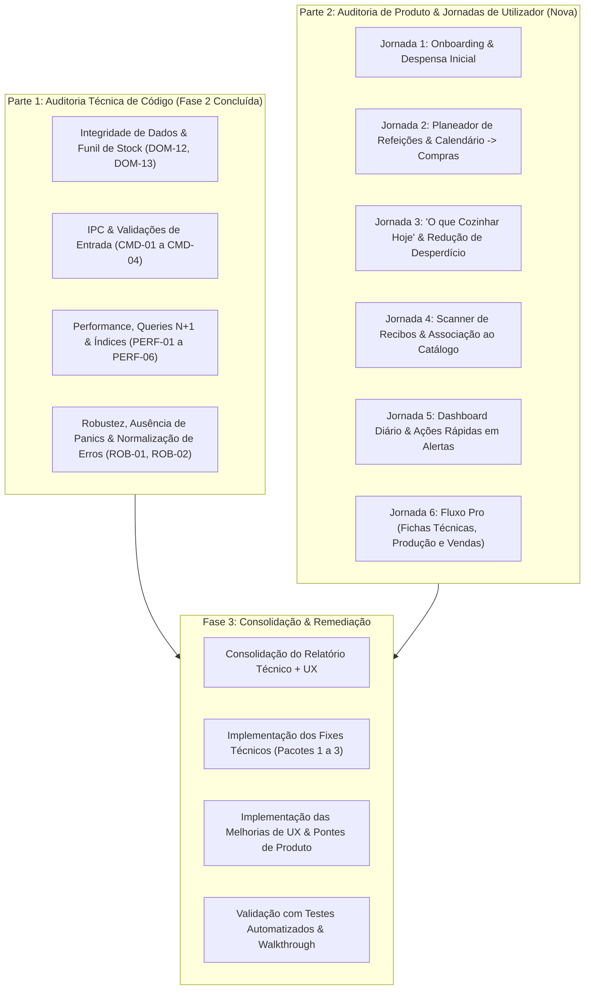
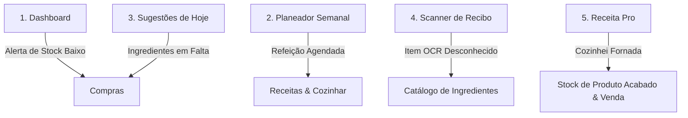

# Plano de Auditoria Integral — mise (Recipe Planner)

## Visão Geral & Contexto

O **mise** é uma aplicação desktop local-first desenvolvida em **Rust (Tauri v2 + libSQL/SQLite)** e **React 19 / TypeScript (Vite)**. O projeto evoluiu significativamente através de sucessivos sprints (S1 a S5) e passou anteriormente por auditorias técnicas.

Esta auditoria está estruturada em **duas grandes dimensões**:
1. **Dimensão Técnica & Código** *(Fases 1, 2 e 3)*: Qualidade de código, integridade de dados, performance de queries (N+1), validações de inputs, concorrência e eliminação de bugs.
2. **Dimensão de Produto, UX & Jornadas de Utilizador** *(nova secção)*: Análise da aplicação do ponto de vista de quem a usa no dia-a-dia, mapeando bloqueios cognitivos, passos manuais redundantes, pontes em falta entre ecrãs e lacunas de produto para as personas **Family** e **Pro**.

- **Branch de Trabalho**: `google-audit`
- **Workflow de Git**: Commits semânticos e push regular para `origin/google-audit`.

---

## Estrutura Global da Auditoria

---

## Parte 2: Auditoria de Produto, UX & Jornadas do Utilizador

### Mapeamento das Duas Personas-Alvo

1. **Persona Family (Doméstica / Cozinha de Casa)**:
   - **Objetivo**: Poupar tempo e dinheiro, evitar desperdício de alimentos no frigorífico, planear as refeições da semana de forma simples e digitalizar talões de compras.
   - **Fricções Típicas**: Ter de reescrever ingredientes à mão, não conseguir cozinhar diretamente a partir do calendário, botões que apenas redirecionam sem preencher dados.

2. **Persona Pro (Micro-Negócio / Confeitaria / Catering)**:
   - **Objetivo**: Conhecer o custo real de cada porção com base nos preços de compra reais, produzir fornadas com rendimento (`yield`), registar vendas e perdas de produtos finais e orçamentar eventos.
   - **Fricções Típicas**: Falta de atalhos diretos para venda de produtos acabados, ausência de visualização do histórico de movimentos de um lote, falta de precificação sugerida.

---

### Eixos de Análise das Jornadas (Trace de Uso & Bloqueios)

#### Jornada 1: Dashboard Diário & Alertas Rápidos
- **Bloqueio Identificado**: No card de alertas de stock baixo em `DashboardPage.tsx:146` (*ex: "Farinha: 0.2 kg · Min: 1.0 kg"*), o botão *"Adicionar à Lista"* é um atalho cego — apenas navega para `/compras` sem adicionar o ingrediente nem calcular a quantidade necessária (0.8 kg).
- **Proposta de Melhoria**: Criar um modal/ação rápida que insere diretamente o ingrediente na lista de compras ativa com a quantidade em falta pré-calculada (`min_quantity - quantity`).

#### Jornada 2: Planeamento de Refeições & Calendário
- **Bloqueio Identificado**:
  1. Em `CalendarPage.tsx:85`, ao clicar numa refeição planeada para hoje, a ação `handleMealClick` faz `navigate("/receitas")` genérico. O utilizador perde o contexto da refeição e tem de pesquisar a receita novamente na lista.
  2. No `MealPlannerPage.tsx`, não existe um botão *"Cozinhar esta refeição agora"*. Para abater o stock do jantar de terça-feira, o utilizador tem de sair do planeador, ir a Receitas e cozinhar manualmente.
- **Proposta de Melhoria**: Permitir abrir a ficha da receita ou executar *"Cozinhei isto"* diretamente a partir do Calendário e do Planeador Semanal.

#### Jornada 3: "O que Cozinhar Hoje" (Recipe Suggester) & Desperdício
- **Bloqueio Identificado**:
  1. Em `SuggestionsPage.tsx:49`, o botão *"Cozinhar"* assume sempre `multiplier: 1` de forma rígida, sem deixar escolher o número de porções para a família.
  2. Para receitas com cobertura parcial (ex.: 70% cobertura, faltam 2 ovos e natas), não há forma de enviar os ingredientes em falta para a lista de compras num clique.
- **Proposta de Melhoria**: Abrir o modal com seletor de multiplicador/porções e adicionar o botão *"Adicionar ingredientes em falta à Lista de Compras"*.

#### Jornada 4: Scanner de Recibos & Associação Inteligente de Artigos
- **Fricção Identificada**: Em `ReceiptScannerPage.tsx`, os nomes dos talões de supermercado (*"ARROZ CAROLINO CIGALA 1KG"*, *"LEITE UHT M/GORDO MIMOSA"*) nunca coincidem com os nomes curtos do catálogo (*"Arroz"*, *"Leite"*). Como não há seletor de correspondência (autocomplete dropdown), o utilizador é obrigado a apagar e reescrever o nome à mão para não duplicar ingredientes.
- **Proposta de Melhoria**: Adicionar um seletor no revisor de artigos do scanner que sugira ingredientes existentes do catálogo quando o nome for ligeiramente diferente.

#### Jornada 5: Histórico de Movimentos & Ficha de Ingrediente
- **Lacuna Identificada**: O backend possui a função `stock_movements_for_ingredient`, mas na página de Stock (`StockPage.tsx`) o utilizador só vê o número estático da quantidade atual. Não consegue responder a: *"Quando é que comprei este azeite e quanto paguei?"* ou *"Quem fez o ajuste de stock?"*.
- **Proposta de Melhoria**: Adicionar um drawer ou modal *"Histórico de Movimentos"* ao clicar numa linha de stock.

#### Jornada 6: Fluxo Pro de Produção e Venda
- **Lacuna Identificada**: Quando um utilizador Pro produz 50 bolachas a partir de uma receita (`yields_product: true`), o saldo do produto final fica guardado em movimentos, mas na página de Receitas não é evidente quantas unidades prontas existem em stock nem há um botão direto *"Vender"* ao lado da receita.
- **Proposta de Melhoria**: Exibir badge de *"X unidades prontas em stock"* na listagem de receitas para utilizadores Pro com botão de venda rápida.

---

## Estrutura de Execução da Fase 3 (Consolidação & Remediação)

A Fase 3 integrará as correções técnicas e as melhorias de produto selecionadas:

1. **Lote 1 (Técnico / Performance & Integridade)**:
   - Fix `PERF-02` (N+1 em `suggest_recipes`)
   - Fix `DOM-12` (Funil de movimentos em `stock_upsert`)
   - Fix `PERF-01`, `PERF-04`, `PERF-05`, `PERF-06` (Índices, pesos aproximados e lazy loading do Tesseract)
   - Fix `CMD-01` a `CMD-03` (Validações de inputs)
2. **Lote 2 (Experiência do Utilizador & Pontes de Produto)**:
   - Atalho real de *"Adicionar à Lista"* no Dashboard a partir de alertas de stock baixo.
   - Ação direta *"Cozinhar / Ver Receita"* ao clicar em refeições no Calendário.
   - Multiplicador de porções e envio de ingredientes em falta para a lista de compras em `SuggestionsPage.tsx`.
   - Seletor de associação de ingredientes no `ReceiptScannerPage.tsx`.
3. **Lote 3 (Validação & Fecho)**:
   - Testes automatizados de regressão (`cargo test --workspace`).
   - Validação de build TypeScript e Vite.
   - Walkthrough documentado.
